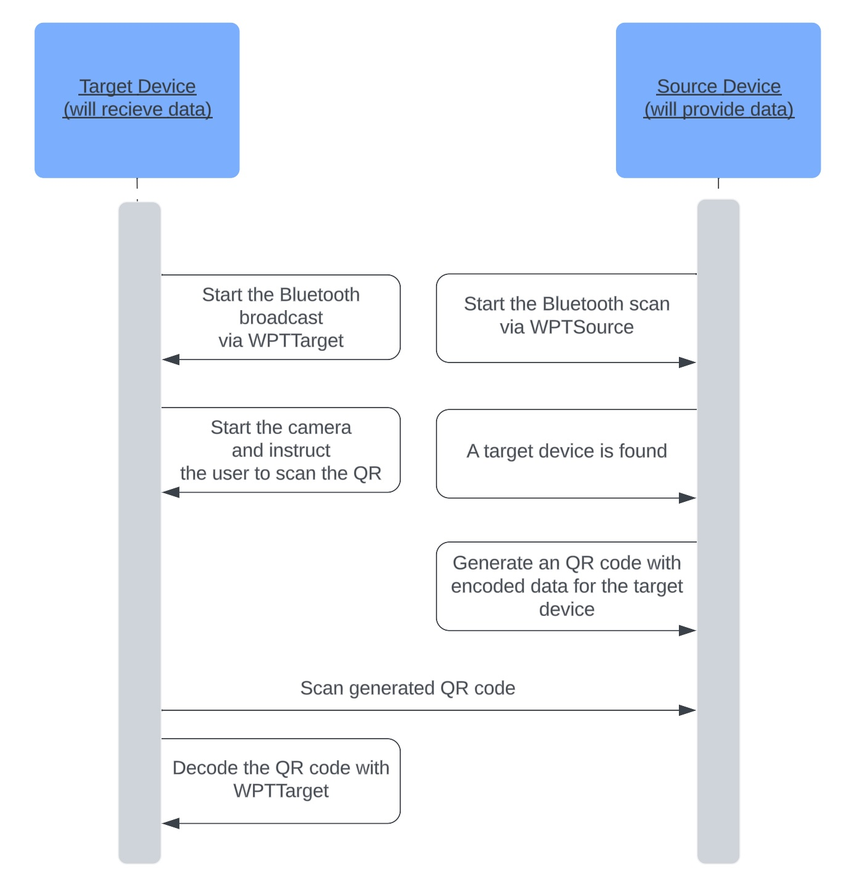

# User Flow Scenario

The process of the transfer can be explained in several steps:

1. The __target device__ (that will receive data) __starts broadcasting__ via Bluetooth.
2. The __source device starts scanning__ for Bluetooth devices.
3. The __target device is found__.
4. A __QR code__ with encrypted transfer data (tailored for the target device) is created and __displayed__.
5. The __source device scans__ the QR code.
6. The __source device decodes__ the QR code.

<!-- begin box warning -->
This user scenario doesn't include unhappy paths where the user might need to grant permissions to the Bluetooth and Camera nor doesn't consider errors that can be produced during the transfer.
<!-- end -->

## Read next

- [Transfer Data](./Transfer-Data.md)
